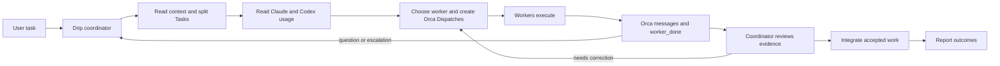

# Robusta

Robusta is a collection of agent skills. **Drip** is the first skill: a coordinator for supervised worker agents using [Orca orchestration](https://www.onorca.dev/docs/cli/orchestration).

## Install Drip

Prerequisites: Orca Desktop with its CLI available, orchestration enabled, and at least one agent CLI that Orca can launch. Current Orca builds can expose active-account usage through `orca account list --json`; older builds need another trustworthy usage source. Use `orca skills get orchestration` for your installed Orca's coordination guide.

Copy `skills/drip` into your agent's skill directory:

| Agent | Destination | Invocation |
| --- | --- | --- |
| Claude Code | `~/.claude/skills/drip/` | `/drip <task>` |
| Codex | `~/.codex/skills/drip/` | `$drip <task>` |

The destination must contain `SKILL.md` directly. Orca does not install Drip into the agent for you. Start a new agent session after copying if the skill does not appear immediately.

## How Drip works



1. **Scope:** Drip reads the request and repository rules, then writes self-contained Task specs with clear file ownership and observable acceptance.
2. **Route:** It reads account-matched usage, computes the lowest remaining percentage across applicable quota windows, reserves capacity for its coordinator, and chooses Claude or Codex for each Task. Unknown usage is never guessed.
3. **Dispatch:** It creates an Orca Run and starts the ready workers. Independent Tasks can run together; dependent Tasks wait for their prerequisites.
4. **Supervise:** It receives questions, escalations, and completion messages through Orca. A quiet terminal is not treated as a completed worker.
5. **Review:** It checks the real output against each Task spec and asks the owner to correct any gap.
6. **Integrate:** It applies accepted work under the repository's Git rules, settles worker terminals, and reports evidence and blockers.

Example request:

```text
/drip Split this feature into independent tasks, assign workers, review their results, and report blockers before integration.
```

Drip has no fixed model IDs, external quota-service dependency, or programming-language requirement. It reads the active account's Orca rate limits first; if no trustworthy usage source is available, it asks for the current numbers. It reads Orca's version-matched guide at the start of each run because the CLI may change.
